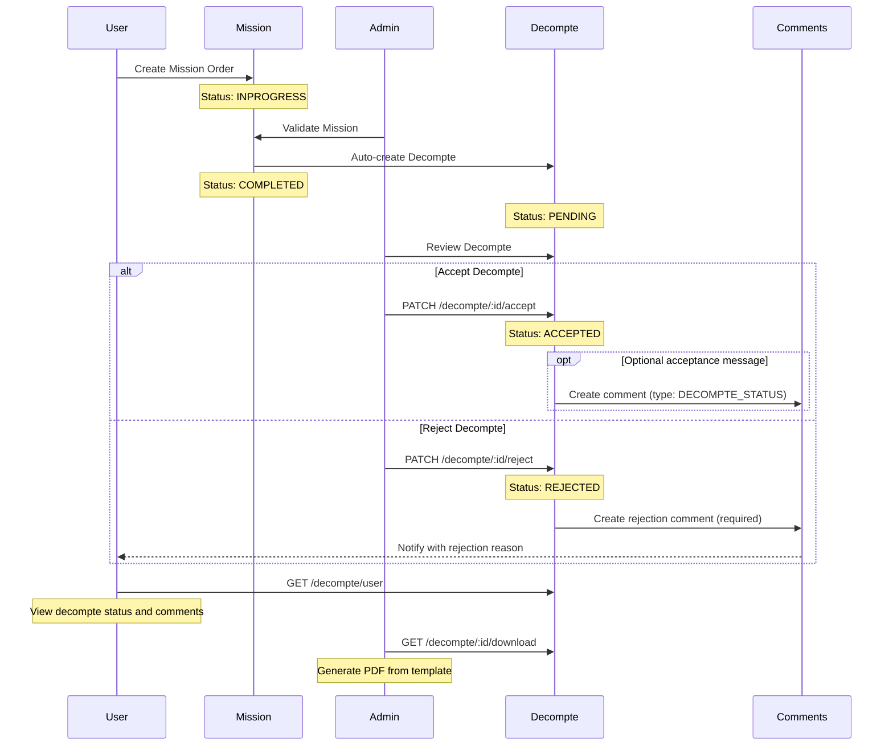
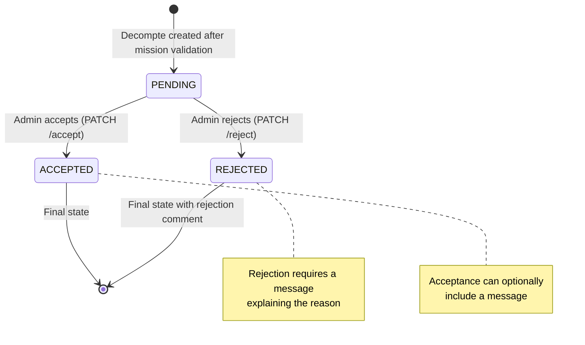

# Decompte Workflow Implementation

## Overview

The decompte (expense reimbursement) feature follows a complete lifecycle from creation after mission completion to admin approval/rejection with optional comments.

## Workflow Diagram



## State Machine



## API Endpoints

### 1. Create Decompte (after mission validation)

**Endpoint:** `POST /decompte/:id`

**Authorization:** Authenticated user

**Request Body:**
```json
{
  "heure_sortie": "09:00",
  "date_retour": "2024-10-30",
  "heure_retour": "18:00",
  "repas_pec": 2,
  "repas_sans_pec": 1,
  "hebergement_pec": 1,
  "hebergement_sans_pec": 0,
  "parcours": 150.5
}
```

**Actions:**
- Updates mission status from `INPROGRESS` to `COMPLETED`
- Updates mission `date_retour` with provided date and time
- Calculates meal and accommodation counts based on duration
- Validates counts match provided values
- Calculates reimbursement amount based on user category and barem
- Creates decompte record with `PENDING` status

### 2. Accept Decompte

**Endpoint:** `PATCH /decompte/:id/accept`

**Authorization:** ADMIN or SUPER_ADMIN only

**Request Body:**
```json
{
  "message": "Optional acceptance message"
}
```

**Actions:**
- Validates decompte is in `PENDING` status
- Updates decompte status to `ACCEPTED`
- Optionally creates a comment if message provided

### 3. Reject Decompte

**Endpoint:** `PATCH /decompte/:id/reject`

**Authorization:** ADMIN or SUPER_ADMIN only

**Request Body:**
```json
{
  "message": "Required rejection reason - e.g., Missing receipts for accommodation"
}
```

**Actions:**
- Validates decompte is in `PENDING` status
- Updates decompte status to `REJECTED`
- Creates a comment with rejection reason (type: `DECOMPTE_STATUS`)

### 4. List All Decomptes (Admin)

**Endpoint:** `GET /decompte?status=pending&exercice=2024`

**Authorization:** Any authenticated user (but typically for admins)

**Query Parameters:**
- `status`: `pending`, `accepted`, or `rejected`
- `exercice`: Year (defaults to current exercice)

**Response includes:**
- Decompte details with calculated amounts
- Related mission information
- User information
- All comments/messages related to the decompte

### 5. List User's Decomptes

**Endpoint:** `GET /decompte/user?status=pending&exercice=2024`

**Authorization:** Authenticated user

**Query Parameters:**
- `status`: `pending`, `accepted`, or `rejected` (optional)
- `exercice`: Year (optional, defaults to current)

**Response includes:**
- User's decomptes
- Mission details
- Comments (especially rejection messages)

### 6. Download Decompte PDF

**Endpoint:** `GET /decompte/:id/download`

**Authorization:** Authenticated user

**Actions:**
- Fetches decompte with mission and user data
- Maps it to printable fields (`src/pdf/mappers/decompte.mapper.ts`, see Document Fields below)
- Renders the PDF natively with `@react-pdf/renderer` (`src/pdf/documents/decompte-document.tsx`)
- Returns PDF file as download

## Document Fields

The décompte PDF is built from `DecomptePdfData` (`src/pdf/mappers/decompte.mapper.ts`):

| Field | Description | Source |
|------------|-------------|--------|
| `numero` / `date` | Décompte N° … du … | `decompte.n_decompte`, `decompte.createdAt` |
| `matricule`, `fullname`, `grade`, `structure` | Identity of the mission owner | `user.*`, `user.structure.name` |
| `reference` | Référence Ordre Mission | `mission.n_mission` |
| `destination`, `motif` | Mission destination and motif | `mission.*` |
| `depart`, `retour` | Date + hour + minute | `mission.date_sortie`, `mission.date_retour` |
| `nbrJours` | Nombre de jours de missions | Calculated from dates |
| `transport` | Avion / Véhicule de service / Véhicule Personnel / Autres | `mission.transport` (no plane value yet) |
| `distance` | Distance parcours (KM) | `decompte.parcours` |
| `indemnite` | Montant Indemnité Kilométrique | `parcours × barem.montant_km` for `PERSONAL_CAR`, else 0 |
| `pec.oui` | Prise en charge — Oui: repas / nuitées | `repas_pec`, `hebergement_pec` |
| `pec.non` | Prise en charge — Non: repas / nuitées | `repas_sans_pec`, `hebergement_sans_pec` |
| `fraisTransport` | Frais de transports Engagés | `decompte.fees_transport` |
| `montantTotal` | Montant Total | `decompte.montant` |

Nord/Sud: only the column matching `mission.direction` is filled; the other stays blank.

## Calculation Logic

### Meal and Accommodation Calculation

The system automatically calculates expected meals and accommodations based on trip duration:

- **Lunch:** 11:00 - 14:00 (1 meal)
- **Dinner:** 18:00 - 21:00 (1 meal)
- **Accommodation:** 00:00 - 06:00 (1 night)

The provided counts must match the calculated values based on the mission start and end times.

### Amount Calculation

```typescript
// Base calculation
if (mission.direction === 'NORD') {
  montant = (hebergement_total * barem.hebergement_nord) +
            (repas_total * barem.repas_nord)
} else {
  montant = (hebergement_total * barem.hebergement_sud) +
            (repas_total * barem.repas_sud)
}

// Add travel costs if personal car
if (mission.transport === 'PERSONAL_CAR') {
  montant += parcours * barem.montant_km
}

// Reduce by 75% if any coverage provided
if (hebergement_pec > 0 || repas_pec > 0) {
  montant = montant * 0.25
}
```

## Data Models

### Decompte Model (Prisma Schema)

```prisma
model Decompte {
  n_decompte           Int             @default(autoincrement()) @id
  repas_pec            Int             @default(0)
  repas_sans_pec       Int             @default(0)
  hebergement_pec      Int             @default(0)
  hebergement_sans_pec Int             @default(0)
  montant              Float
  parcours             Float?
  status               DecompteStatus  @default(PENDING)
  createdAt            DateTime        @default(now())
  updatedAt            DateTime        @updatedAt
  soft_delete          Boolean         @default(false)
  mission              Mission         @relation(fields: [missionId], references: [n_mission])
  missionId            Int
  messages             Commentaire[]
  exercice             Exercice?       @relation(fields: [exerciceId], references: [id])
  exerciceId           Int?
}

enum DecompteStatus {
  PENDING
  ACCEPTED
  REGECTED  // Note: typo in original schema
}
```

### Comment Model (for rejection messages)

```prisma
model Commentaire {
  id          Int         @default(autoincrement()) @id
  title       String
  type        MessageType
  status      String
  user        User        @relation(fields: [userId], references: [matricule])
  userId      Int
  decompte    Decompte?   @relation(fields: [decompteId], references: [n_decompte])
  decompteId  Int?
  createdAt   DateTime    @default(now())
  updatedAt   DateTime    @updatedAt
  soft_delete Boolean     @default(false)
}

enum MessageType {
  FORGET_PASSWORD
  DECOMPTE_STATUS
  OTHER
}
```

## File Structure

```
server/src/
├── decompte/
│   ├── dto/
│   │   ├── accept-decompte.dto.ts      # DTO for acceptance (optional message)
│   │   ├── reject-decompte.dto.ts      # DTO for rejection (required message)
│   │   ├── create-decompte.dto.ts      # DTO for decompte creation
│   │   └── update-decompte.dto.ts      # DTO for updates
│   ├── decompte.controller.ts          # REST endpoints
│   ├── decompte.service.ts             # Business logic
│   └── decompte.module.ts              # Module with CommentsModule + PdfModule imports
├── comments/
│   ├── dto/
│   │   └── create-comment.dto.ts
│   ├── comments.controller.ts
│   ├── comments.service.ts
│   └── comments.module.ts
└── missions/
    └── ...
```

## Integration Points

### 1. Mission Validation → Decompte Creation

When a mission is validated by an admin, the system automatically:
- Changes mission status to `COMPLETED`
- Updates mission return date/time
- Creates a new decompte record with `PENDING` status

### 2. Decompte Rejection → Comment Creation

When a decompte is rejected:
- A `Commentaire` record is created with:
  - `type`: `DECOMPTE_STATUS`
  - `status`: `REJECTED`
  - `title`: Includes rejection message
  - `decompteId`: Links to the decompte
  - `userId`: Admin who rejected it

### 3. Comments Module Integration

The decompte module imports and uses `CommentsService` to:
- Create rejection comments automatically
- Optionally create acceptance comments
- Users can view these comments when checking their decompte status

## Usage Examples

### Example 1: Complete Workflow (User Perspective)

1. User creates a mission order (ordre)
2. Admin validates the order → Mission status becomes `COMPLETED`, decompte is created with `PENDING` status
3. User checks decompte status: `GET /decompte/user?status=pending`
4. Admin reviews and rejects with reason
5. User sees rejection comment when checking: `GET /decompte/user`
6. User contacts admin to resolve issue
7. Admin accepts updated information: `PATCH /decompte/:id/accept`

### Example 2: Admin Review Process

```bash
# List all pending decomptes
GET /decompte?status=pending&exercice=2024

# Review specific decompte
GET /decompte/123

# Accept the decompte
PATCH /decompte/123/accept
{
  "message": "Approved after verification of receipts"
}

# Or reject with reason
PATCH /decompte/123/reject
{
  "message": "Missing hotel invoice for night of Oct 15. Please provide receipt."
}
```

## Error Handling

The system validates:

1. **Decompte Creation:**
   - Mission must exist
   - Meal/accommodation counts must match calculated duration
   - User must have a category for barem lookup

2. **Accept/Reject:**
   - Decompte must exist and not be soft-deleted
   - Decompte must be in `PENDING` status
   - Only admins can accept/reject
   - Rejection requires a message

3. **PDF Generation:**
   - Decompte must exist (mission, owner and structure are loaded with it)
   - Missing values print as blank boxes, never "null"/"undefined"
   - Render errors return 500 (InternalServerErrorException)

## Benefits of This Implementation

1. **Follows Mission Pattern:** Reuses proven patterns from ordre/mission implementation
2. **Admin Workflow:** Clear accept/reject process with audit trail via comments
3. **User Transparency:** Users can see rejection reasons and track their decompte status
4. **Automatic Calculation:** Reduces manual errors in amount calculation
5. **PDF Generation:** Professional documents generated from Word template
6. **Audit Trail:** Comments provide history of acceptance/rejection decisions
7. **Status-Based Filtering:** Easy to filter by pending/accepted/rejected status
8. **Exercice Support:** Proper segregation by fiscal year

## Future Enhancements

Potential improvements:
- Email notifications on status changes
- Ability to edit and resubmit rejected decomptes
- Attachment support for receipts/invoices
- More detailed breakdown of calculations in PDF
- Dashboard statistics for admin (pending count, average processing time, etc.)
